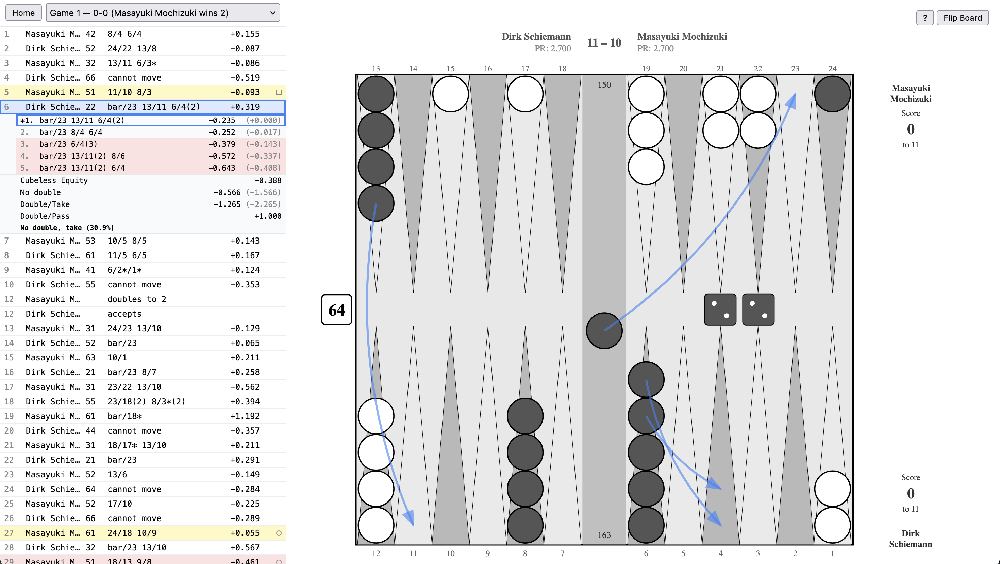

# BGAnalyze

[](https://github.com/drewolson/bganalyze/actions/workflows/ci.yml)



BGAnalyze is a web-based frontend for GNU Backgammon analysis delivered as a
single, stand-alone binary. Upload match files and get move-by-move analysis
with an interactive board, move arrows, and match statistics.

Supported file formats: `.mat`, `.sgf`, `.gam`, `.sgg`, `.tmg`, `.txt`

## Installation

* Install `gnubg` (see below)
* Download a pre-compiled `bganalyze` binary for macOS (Apple Silicon), Linux
  (amd, arm), or Windows from the [latest
  release](https://github.com/drewolson/bganalyze/releases/latest)
* Run `./bganalyze`
* Open [http://localhost:8080](http://localhost:8080) in your browser.

### Configuration

By default, `bganalyze` listens on port 8080. Use `--port` to change it:

```sh
./bganalyze --port 3000
```

If `gnubg` is not on your `PATH` or you prefer to specific its location
directly, use `--gnubgpath`:

```sh
./bganalyze --gnubgpath /usr/local/bin/gnubg
```

Analysis history is stored in a [bbolt](https://github.com/etcd-io/bbolt)
database. By default, the database lives in your OS config directory
(`~/Library/Application Support/bganalyze` on macOS, `~/.config/bganalyze` on
Linux). Use `--datadir` to override:

```sh
./bganalyze --datadir /path/to/data
```

See `./bganalyze --help` for detailed usage information.

### GNU Backgammon Installation Recommendations

On macOS, build from the forked source
[here](https://github.com/nodots/gnubg-macos).

On Debian/Ubuntu:

```sh
sudo apt install gnubg
```

## Development

### Prerequisites

- [Go](https://go.dev/) 1.22+
- [Node.js](https://nodejs.org/) 18+
- [GNU Backgammon](https://www.gnu.org/software/gnubg/) (`gnubg`) installed and
  available on your `PATH`


### Build

```sh
make build
```

This builds the frontend (Vite + React) and compiles everything into a single
self-contained binary. The frontend assets are embedded into the Go binary via
`go:embed`, so there are no extra files to deploy — just run `bganalyze` on your
machine alongside `gnubg`.

### Run

```sh
make run
```

Or run the binary directly:

```sh
./bganalyze
```

### Test

```sh
make test
```

Runs both Go and frontend test suites.
